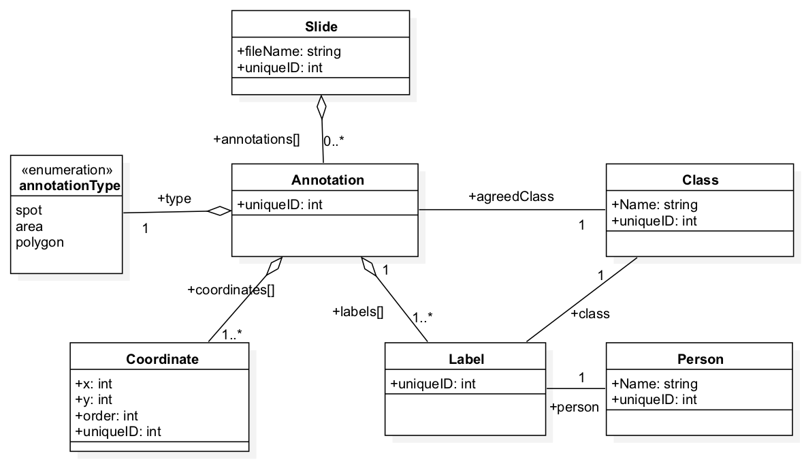

# SlideRunner 

*SlideRunner* is a tool for massive cell annotations in whole slide images.

It has been created in close cooperation between the Pattern Recognition Lab, Friedrich-Alexander-Universität Erlangen-Nürnberg and the Institute of Veterenary Pathology, Freie Universität Berlin.

If you use the software for research purposes, please cite our paper:

> M. Aubreville, C. Bertram, R. Klopfleisch and A. Maier (2018): SlideRunner - A Tool for Massive Cell Annotations in Whole Slide Images, In: Bildverarbeitung für die Medizin 2018, 	arXiv:1802.02347 <a href="https://arxiv.org/abs/1802.02347">preprint pdf</a>

Please find the authors webpage at: https://www5.cs.fau.de/~aubreville/

## Installation

SlideRunner is written in Python 3, so you will need a Python 3 distribution like e.g. Anaconda (https://www.anaconda.com/download/) to run it.

### Install using PIP

We provide a convenient installation by using pip. On Linux or Mac, simply run:

>sudo pip install -U SlideRunner

On windows, pip should install without sudo (untested):

>pip install -U SlideRunner

## Installation from repository

You need to clone this repository:

>git clone https://github.com/maubreville/SlideRunner

In order to use the automated installation process, you need to have setuptools installed.
>pip install -U setuptools

The installation procedure is then as easy as:
>cd SlideRunner
>python setup.py install

To run, the following libraries and their dependencies will be installed:

Library           | version           |  link             
------------------|-------------------|-------------------
PyQT5             | >= 5.6.0         | https://pyqt.sourceforge.net/
numpy             | >= 1.13           | https://www.numpy.org
cv2 (OpenCV3)     | >= 3.1.0          | https://opencv.org
sqlite3           | >= 2.6.0          | https://www.sqlite.org
openslide         | >= 1.1.1          | https://www.openslide.org

## Screenshots

## Database structure

The major entity of our database model is the annotation. Each annotation can have multiple coordinates, with their respective x and y coordinates, and the order they were drawn (for polygons). Further, each annotation has a multitude of labels that were given by one person each and are belonging to one class, respectively. 

